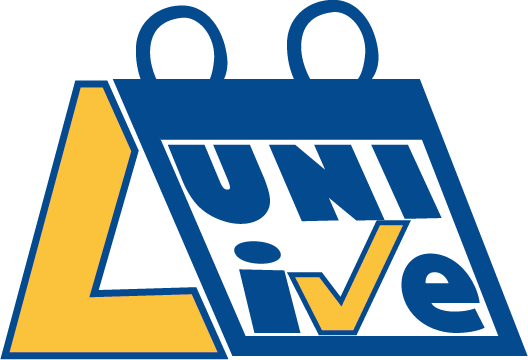
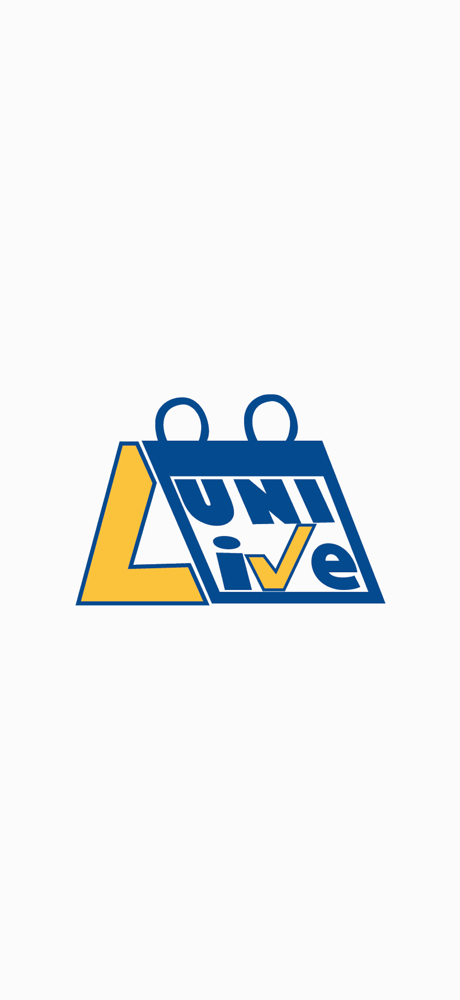
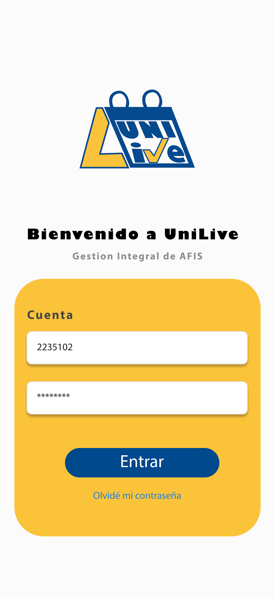
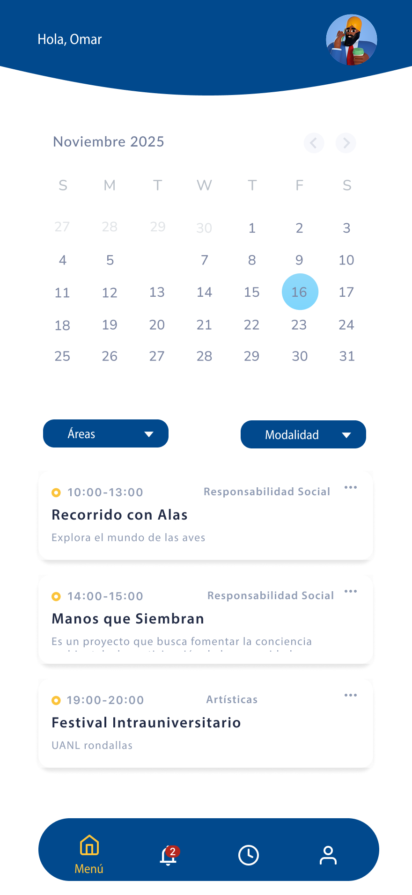
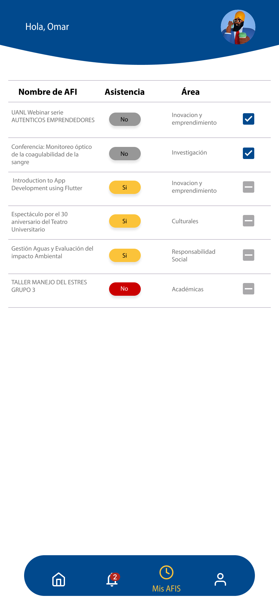
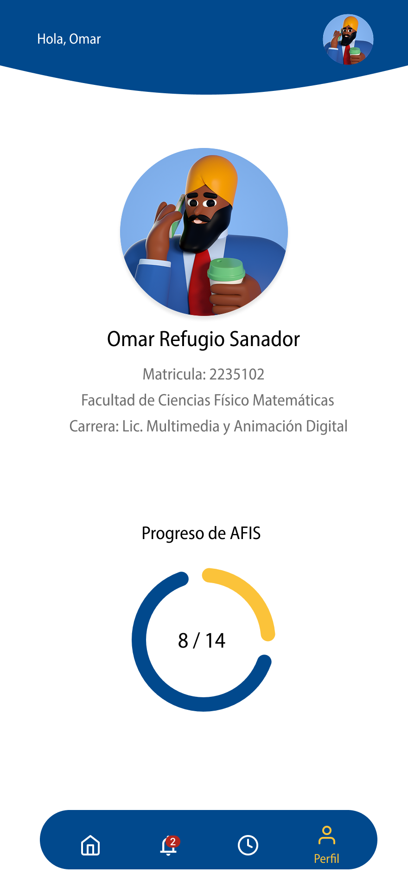
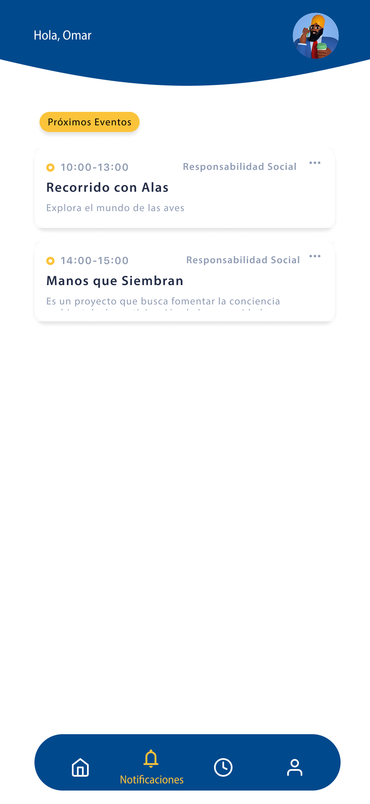
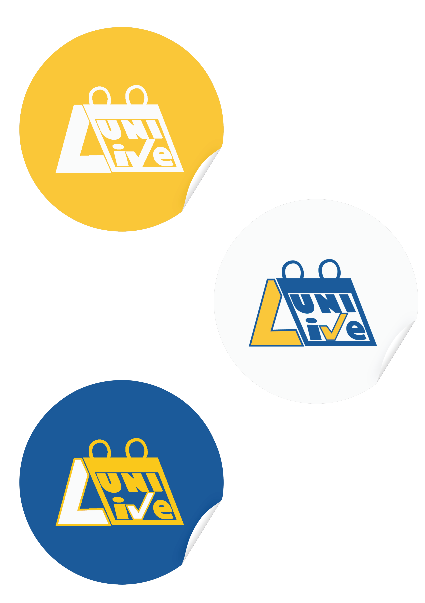
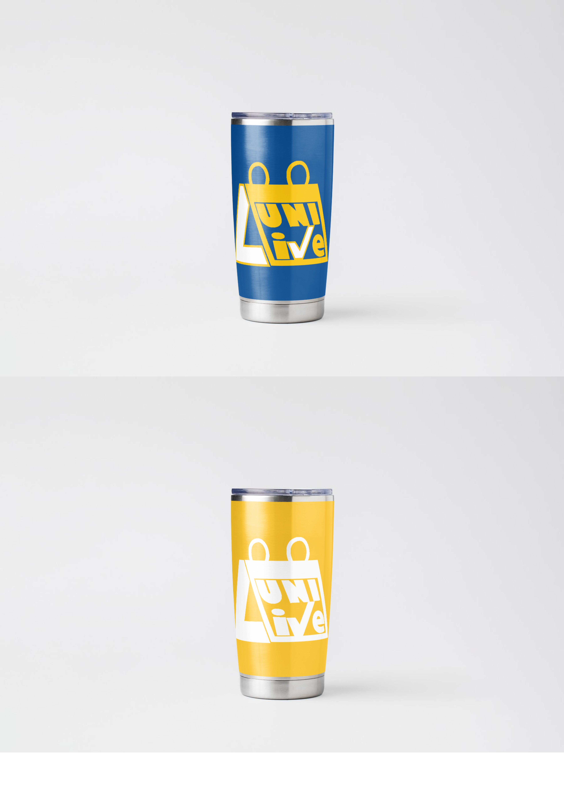
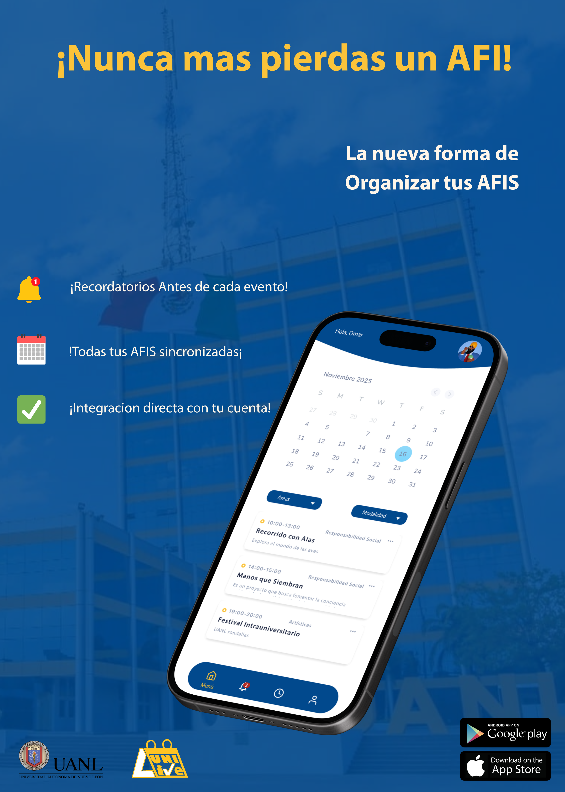

# 🦁 UniLive - Tu Vida Universitaria en un Click

> **Proyecto de Diseño de Producto, UX/UI y Estrategia de Marca**
> *Facultad de Ciencias Físico Matemáticas - UANL*

**UniLive** es una propuesta de ecosistema digital diseñada para resolver la fragmentación de información en las *Actividades de Formación Integral (AFIs)* de la UANL. La plataforma centraliza la difusión, inscripción y validación de eventos académicos, culturales y deportivos en una sola aplicación intuitiva.

## 💡 La Problemática
Actualmente, los estudiantes enfrentan dificultades para enterarse de las AFIs a tiempo debido a la dispersión de la información en múltiples canales no oficiales. Esto resulta en créditos faltantes y baja participación.

## 🚀 Nuestra Solución: Propuesta de Valor
UniLive actúa como el **puente oficial** entre la administración universitaria y el alumnado, ofreciendo:
1.  **Centralización:** Todas las AFIs (Congresos, Talleres, Torneos) en un solo feed.
2.  **Inmediatez:** Notificaciones en tiempo real sobre cupos y nuevas fechas.
3.  **Gestión Personal:** Kárdex digital para monitorear el progreso de créditos.

## 🎨 Diseño de Experiencia (UX/UI)

Se desarrolló un prototipo de alta fidelidad enfocado en la usabilidad móvil (**Mobile First**), respetando la identidad institucional pero modernizando la interfaz.

### Galería del Prototipo
| Onboarding & Login | Feed de Eventos & mis AFIS | Perfil & Notificaciones |
| :---: | :---: | :---: |
|   |   |   |

> **🎨 [Ver Prototipo Interactivo en Figma](https://www.figma.com/proto/WisecVi04g9VVX2E2idbyX/UniLive?page-id=0%3A1&node-id=1-3&p=f&viewport=322%2C306%2C0.32&t=0o4ded1qtpiywYGJ-1&scaling=scale-down&content-scaling=fixed&starting-point-node-id=4%3A562)**

## 📢 Identidad Corporativa y Branding

El proyecto incluyó el desarrollo completo de la imagen de marca, aplicando psicología del color para transmitir **Energía (Naranja)**, **Confianza (Azul)** y **Pasión Universitaria**.

### 👕 Mercancía Oficial (Merch)
| Playeras | Termos y Bolsa | Accesorios |
| :---: | :---: | :---: |
|  |  |  |
|  |  | . |

### 📱 Estrategia de Redes Sociales
| Flyer Promocional | Post de Instagram | Spot de Video |
| :---: | :---: | :---: |
|  |  |  |

## 📊 Documentación de Negocio

El desarrollo se fundamenta en un análisis de viabilidad exhaustivo:
- [📄 **Leer Plan de Negocios Completo (PDF)**](./Docs/UniLive.pdf)
  - *Incluye: Análisis FODA, Estudio de Mercado, Misión/Visión y Presupuesto Operativo.*

## 🛠️ Herramientas Creativas
* **Prototipado:** Figma.
* **Diseño Vectorial:** Adobe Illustrator / Canva.
* **Edición Audiovisual:** Adobe Premiere Pro / CapCut.
* **Gestión de Proyecto:** Trello.

## 👥 Créditos
**Equipo 5 - Grupo 051**
* **Jose Armando Hernandez Santander** - *Diseño de Producto & Estrategia de Marca*
* **Alma Daniela Garza Palomino** - *Colaboradores*
* **Erick Franco Mendez Estrada** - *Colaboradores*
* **Stibaly Jaretzi Rios Sifuentes** - *Colaboradores*
* **Abraham Alexander Hinojosa Gonzales** - *Colaboradores*

---
*Proyecto Integrador de Aprendizaje (PIA) - Proyección Personal y Profesional - LMAD 2024*
